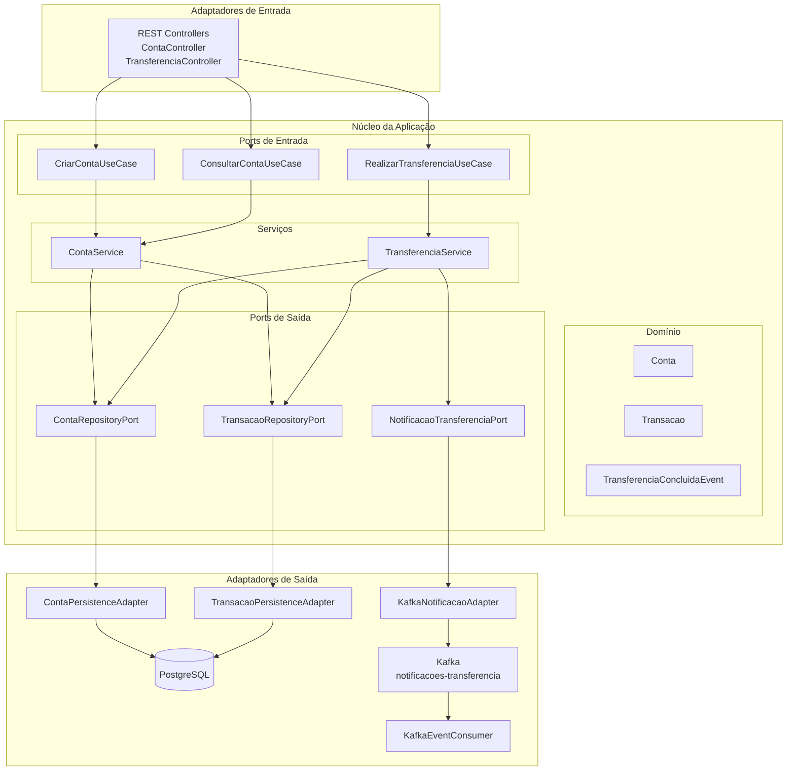
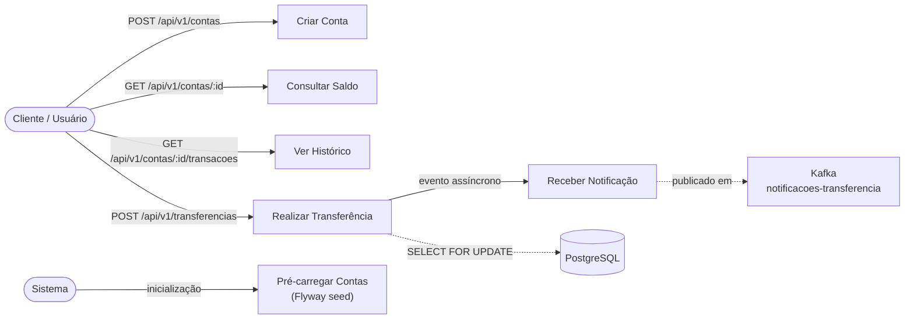

# Compass Bank API

API REST para banco digital com transferência de valores entre contas, gestão de contas e notificações assíncronas via Apache Kafka.

[](https://github.com/cordeirops/compass-bank/actions/workflows/ci.yml)

---

## Stack Tecnológica

| Tecnologia | Versão | Finalidade |
|---|---|---|
| Java | 21 (LTS) | Linguagem principal + Virtual Threads (Project Loom) |
| Spring Boot | 4.0.6 | Framework principal |
| PostgreSQL | 16 | Banco de dados relacional |
| Apache Kafka | 3.9 (KRaft) | Notificações assíncronas |
| Flyway | gerenciado pelo Boot | Migrações de schema |
| Docker / Compose | - | Orquestração local |
| Maven | 3.9 | Build e dependências |

---

## Arquitetura

O projeto adota **Arquitetura Hexagonal** (Ports & Adapters), separando o núcleo de negócio dos detalhes de infraestrutura.



### Estrutura de Pacotes

```
org.cordeirops.compassbank/
├── domain/
│   ├── model/          Conta, Transacao, TipoTransacao
│   ├── exception/      ContaNaoEncontradaException, SaldoInsuficienteException, ...
│   └── event/          TransferenciaConcluidaEvent
├── application/
│   ├── port/in/        CriarContaUseCase, RealizarTransferenciaUseCase, ConsultarContaUseCase
│   ├── port/out/       ContaRepositoryPort, TransacaoRepositoryPort, NotificacaoTransferenciaPort
│   ├── dto/            TransferenciaResultado
│   └── service/        ContaService, TransferenciaService
├── adapter/
│   ├── in/web/         ContaController, TransferenciaController, dto/
│   └── out/
│       ├── persistence/ entity/, repository/ (JPA), adapter/
│       └── messaging/   KafkaNotificacaoTransferenciaAdapter, KafkaTransferenciaEventConsumer
└── config/             KafkaConfig, OpenApiConfig, GlobalExceptionHandler
```

---

## Diagrama de Casos de Uso



---

## Controle de Alta Concorrência

O sistema foi projetado para cenários de alta concorrência com três camadas de proteção:

### 1. Lock Pessimista (PostgreSQL `SELECT FOR UPDATE`)

O método `findByIdComLock()` usa `@Lock(LockModeType.PESSIMISTIC_WRITE)` do JPA, que se traduz em `SELECT * FROM contas WHERE id = ? FOR UPDATE` no PostgreSQL. Nenhuma outra transação pode modificar a conta travada até que a transação atual seja confirmada.

### 2. Prevenção de Deadlock por Ordenação de UUID

O `TransferenciaService` sempre adquire os locks na **ordem crescente de UUID**. Sem isso, dois threads concorrentes poderiam criar uma espera circular:

```
Thread A: trava conta_1, espera conta_2
Thread B: trava conta_2, espera conta_1  ← DEADLOCK
```

Com ordenação consistente, ambos competem pelo mesmo lock primeiro — um avança, o outro aguarda:

```
Thread A: trava conta_1 (sucesso), trava conta_2 → commit
Thread B: aguarda conta_1 → trava conta_1, trava conta_2 → commit
```

### 3. Threads Virtuais (Project Loom)

`spring.threads.virtual.enabled=true` habilita threads virtuais no Java 21. Quando uma thread virtual aguarda um lock do banco de dados, ela é **desmontada do OS thread** e o OS thread fica disponível para outra thread virtual. Isso permite que milhares de requisições concorrentes aguardem por locks sem esgotar o pool de OS threads.

---

## Endpoints da API

| Método | Endpoint | Descrição | Status |
|--------|----------|-----------|--------|
| `POST` | `/api/v1/contas` | Criar nova conta | `201` |
| `GET` | `/api/v1/contas/{id}` | Consultar saldo | `200` |
| `GET` | `/api/v1/contas/{id}/transacoes` | Histórico de movimentações | `200` |
| `POST` | `/api/v1/transferencias` | Realizar transferência | `201` |

### Contas pré-carregadas (seed)

| ID | Nome | Saldo inicial |
|----|------|--------------|
| `a0000000-0000-0000-0000-000000000001` | Ana Silva | R$ 5.000,00 |
| `a0000000-0000-0000-0000-000000000002` | Bruno Santos | R$ 3.000,00 |
| `a0000000-0000-0000-0000-000000000003` | Carlos Oliveira | R$ 1.500,00 |
| `a0000000-0000-0000-0000-000000000004` | Daniela Costa | R$ 2.500,00 |
| `a0000000-0000-0000-0000-000000000005` | Eduardo Pereira | R$ 4.000,00 |

### Exemplos

**Criar conta:**
```bash
curl -X POST http://localhost:8080/api/v1/contas \
  -H "Content-Type: application/json" \
  -d '{"nome": "Maria Souza", "saldoInicial": 2000.00}'
```

**Realizar transferência:**
```bash
curl -X POST http://localhost:8080/api/v1/transferencias \
  -H "Content-Type: application/json" \
  -d '{
    "contaOrigemId": "a0000000-0000-0000-0000-000000000001",
    "contaDestinoId": "a0000000-0000-0000-0000-000000000002",
    "valor": 500.00
  }'
```

---

## Como Rodar

### Pré-requisitos

- Docker Desktop instalado e em execução

### Com Docker Compose (recomendado)

```bash
# Sobe PostgreSQL, Kafka (KRaft) e a aplicação
docker-compose up --build

# Acessar a API
http://localhost:8080/api/v1/contas

# Documentação Swagger
http://localhost:8080/swagger-ui.html
```

### Apenas a infraestrutura (PostgreSQL + Kafka)

```bash
docker-compose up postgres kafka
```

Depois configure as variáveis de ambiente e suba a aplicação com:

```bash
export SPRING_DATASOURCE_URL=jdbc:postgresql://localhost:5432/compassbank
export SPRING_DATASOURCE_USERNAME=compassbank
export SPRING_DATASOURCE_PASSWORD=compassbank
export SPRING_KAFKA_BOOTSTRAP_SERVERS=localhost:9092

./mvnw spring-boot:run
```

---

## Testes

```bash
# Executar todos os testes
./mvnw test
```

Os testes utilizam:
- **H2 (modo PostgreSQL)** — banco de dados em memória para testes isolados
- **EmbeddedKafka** — broker Kafka embutido no processo de testes (sem infraestrutura externa)

### Cobertura

| Classe | Tipo | Cenários |
|--------|------|----------|
| `TransferenciaServiceTest` | Mockito puro | Sucesso, saldo insuficiente, mesma conta, conta não encontrada, **ordenação de locks** |
| `ContaServiceTest` | Mockito puro | Criar, buscar, histórico, exceções |
| `ContaControllerTest` | MockMvc standalone | HTTP 201/400/404, validações |
| `TransferenciaControllerTest` | MockMvc standalone | HTTP 201/400/422, validações |
| `CompassBankApplicationTests` | Spring Boot + EmbeddedKafka | Context loads |

---

## Pipeline CI/CD (GitHub Actions)

O workflow `.github/workflows/ci.yml` é acionado em todo **push para a branch `main`** e em **pull requests**:

```
push/PR → main
     │
     ▼
┌─────────────────────────────────┐
│  1. Checkout do código          │
│  2. Setup Java 21 (Temurin)     │
│  3. Cache de dependências Maven │
│  4. ./mvnw test                 │
│     ├── H2 (sem PostgreSQL)     │
│     └── EmbeddedKafka           │
│  5. Upload relatório Surefire   │
└─────────────────────────────────┘
```

Nenhum serviço externo é necessário no CI — toda a infraestrutura de testes é embutida no processo Java.

---

## Otimizações Docker

O `Dockerfile` usa **build multi-stage com JAR em camadas** do Spring Boot:

```
eclipse-temurin:21-jdk-alpine   ← Stage 1: build
        │
        │ mvnw package
        │ java -Djarmode=layertools extract
        ▼
eclipse-temurin:21-jre-alpine   ← Stage 2: runtime
        │
        ├── dependencies/        ← raramente mudam → cache Docker estável
        ├── spring-boot-loader/  ← raramente mudam
        ├── snapshot-dependencies/
        └── application/         ← muda a cada commit → única camada reconstruída
```

**Vantagem**: o rebuild em uma mudança de código leva ~10 segundos (apenas a camada `application/`), contra ~2 minutos em um build sem camadas.

**GC**: ZGC generacional (`-XX:+UseZGC -XX:+ZGenerational`) para baixa latência com alta concorrência.

---

## Notificações Kafka

Após cada transferência bem-sucedida, um evento é publicado no tópico `notificacoes-transferencia` (3 partições).

**Schema do evento:**
```json
{
  "transferenciaId": "uuid",
  "contaOrigemId": "uuid",
  "contaDestinoId": "uuid",
  "valor": "200.00",
  "ocorridaEm": "2026-06-05T14:30:00"
}
```

A chave da mensagem é o `contaOrigemId`, garantindo que todas as transferências da mesma conta de origem sejam processadas em ordem dentro de uma partição.

O consumer `KafkaTransferenciaEventConsumer` é extensível para envio de e-mail, SMS, push notification ou análise de fraude.

---

## Decisões de Design

| Decisão | Motivação |
|---------|-----------|
| Arquitetura Hexagonal | Isola o domínio de banco, Kafka e HTTP — testabilidade máxima |
| Lock Pessimista + UUID ordering | Garante consistência sem race conditions em cenários de alta concorrência |
| Threads Virtuais (Project Loom) | Escala para milhares de requisições concorrentes sem overhead de OS threads |
| Flyway | Versionamento explícito e auditável do schema de banco |
| KRaft (Kafka sem ZooKeeper) | Simplifica a infra local — um container a menos |
| JAR em camadas | Rebuild Docker ~10× mais rápido aproveitando cache de dependências |
| EmbeddedKafka nos testes | Testes de integração independentes de infraestrutura externa |
